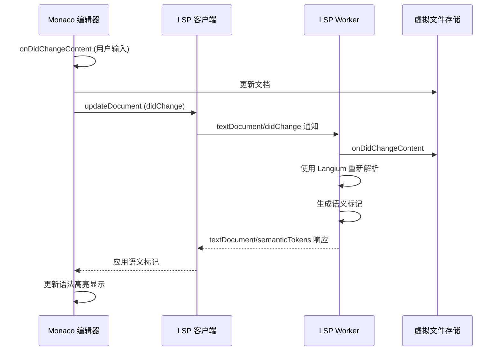
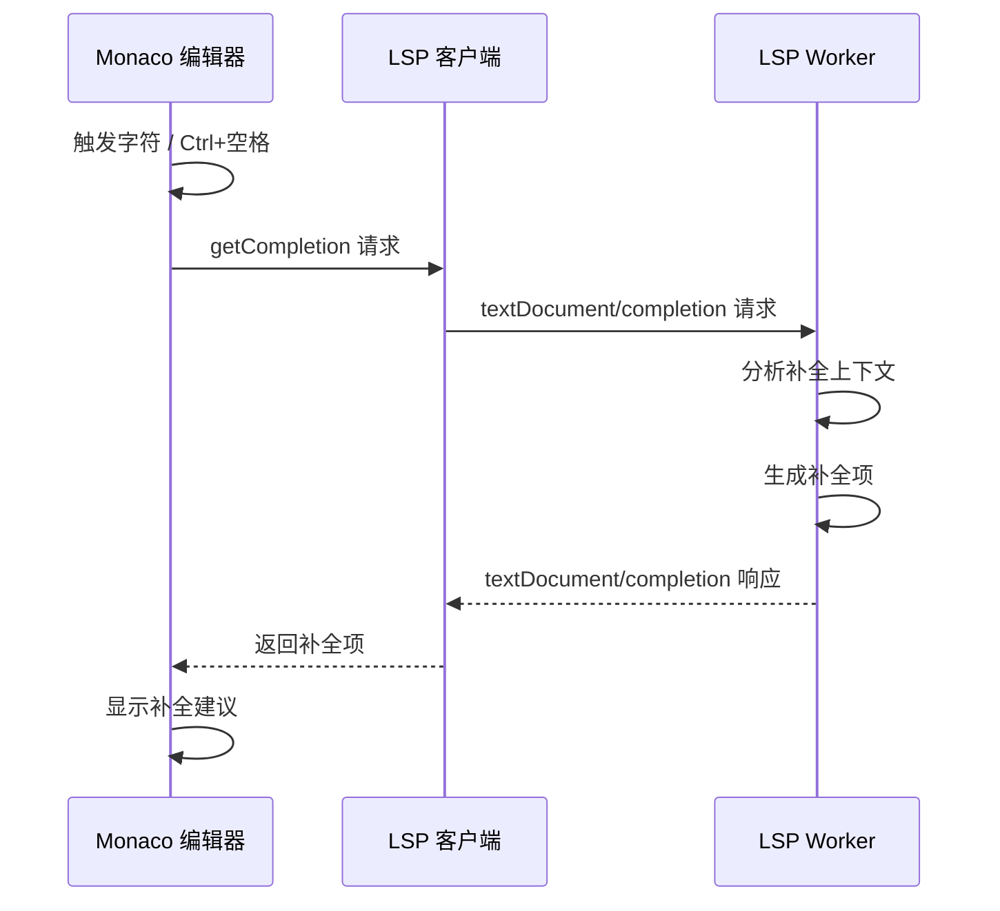
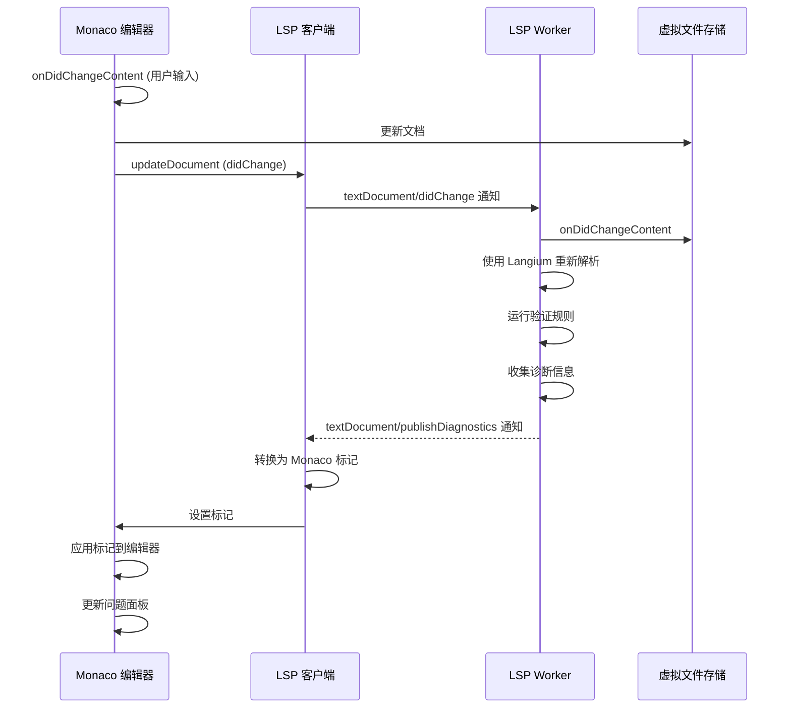
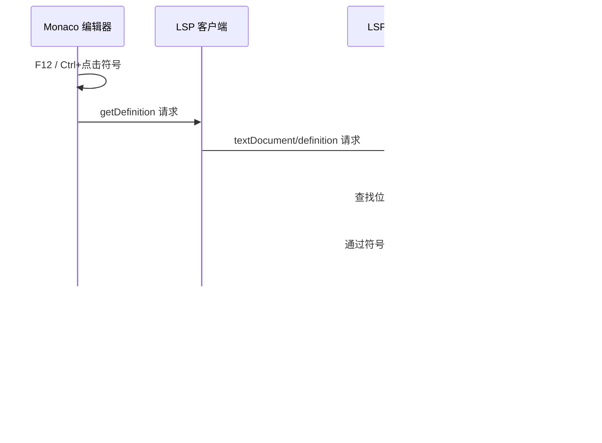
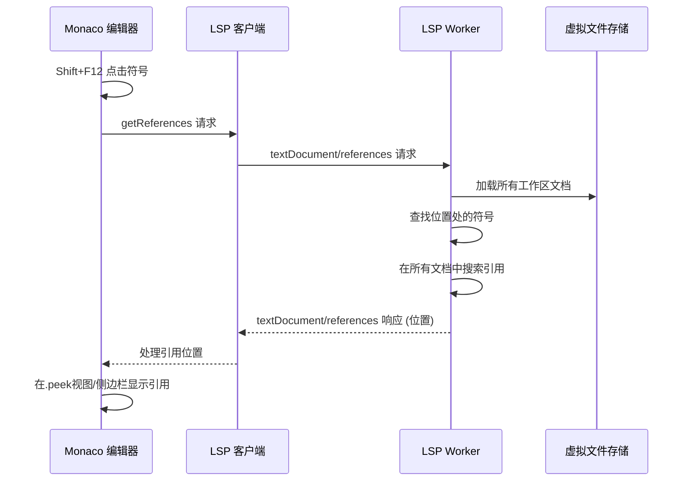
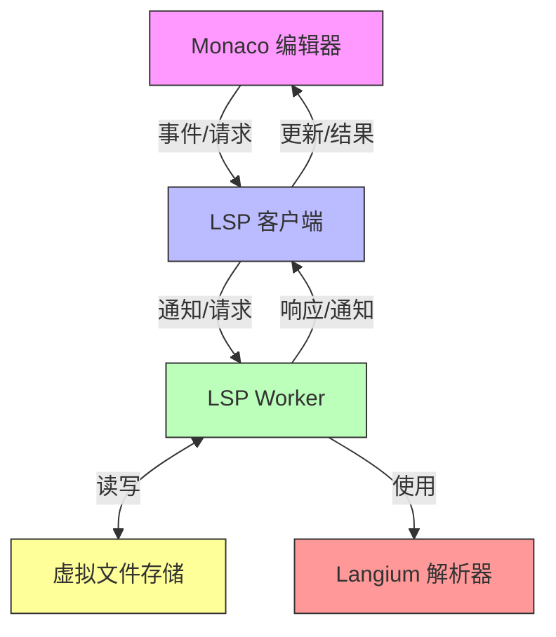

# 执行流程图

本文档包含 Mermaid 序列图，用于展示 SysML v2 LSP 实现中的执行流程。

## 语法高亮流程

```mermaid
sequenceDiagram
    participant Monaco as Monaco 编辑器
    participant Client as LSP 客户端
    participant Worker as LSP Worker
    participant VFS as 虚拟文件存储
    
    Monaco->>Monaco: onDidChangeContent (用户输入)
    Monaco->>VFS: 更新文档
    Monaco->>Client: updateDocument (didChange)
    Client->>Worker: textDocument/didChange 通知
    Worker->>VFS: onDidChangeContent
    Worker->>Worker: 使用 Langium 重新解析
    Worker->>Worker: 生成语义标记
    Worker-->>Client: textDocument/semanticTokens 响应
    Client-->>Monaco: 应用语义标记
    Monaco->>Monaco: 更新语法高亮显示
```

## 补全流程

```mermaid
sequenceDiagram
    participant Monaco as Monaco 编辑器
    participant Client as LSP 客户端
    participant Worker as LSP Worker
    
    Monaco->>Monaco: 触发字符 / Ctrl+空格
    Monaco->>Client: getCompletion 请求
    Client->>Worker: textDocument/completion 请求
    Worker->>Worker: 分析补全上下文
    Worker->>Worker: 生成补全项
    Worker-->>Client: textDocument/completion 响应
    Client-->>Monaco: 返回补全项
    Monaco->>Monaco: 显示补全建议
```

## 诊断流程

```mermaid
sequenceDiagram
    participant Monaco as Monaco 编辑器
    participant Client as LSP 客户端
    participant Worker as LSP Worker
    participant VFS as 虚拟文件存储
    
    Monaco->>Monaco: onDidChangeContent (用户输入)
    Monaco->>VFS: 更新文档
    Monaco->>Client: updateDocument (didChange)
    Client->>Worker: textDocument/didChange 通知
    Worker->>VFS: onDidChangeContent
    Worker->>Worker: 使用 Langium 重新解析
    Worker->>Worker: 运行验证规则
    Worker->>Worker: 收集诊断信息
    Worker-->>Client: textDocument/publishDiagnostics 通知
    Client->>Client: 转换为 Monaco 标记
    Client->>Monaco: 设置标记
    Monaco->>Monaco: 应用标记到编辑器
    Monaco->>Monaco: 更新问题面板
```

## 跳转到定义流程

```mermaid
sequenceDiagram
    participant Monaco as Monaco 编辑器
    participant Client as LSP 客户端
    participant Worker as LSP Worker
    participant VFS as 虚拟文件存储
    
    Monaco->>Monaco: F12 / Ctrl+点击符号
    Monaco->>Client: getDefinition 请求
    Client->>Worker: textDocument/definition 请求
    Worker->>VFS: 如需要则加载文档
    Worker->>Worker: 查找位置处的符号
    Worker->>Worker: 通过符号索引解析定义
    Worker-->>Client: textDocument/definition 响应 (位置)
    Client-->>Monaco: 处理定义位置
    Monaco->>Monaco: 导航到定义
```

## 查找引用流程

```mermaid
sequenceDiagram
    participant Monaco as Monaco 编辑器
    participant Client as LSP 客户端
    participant Worker as LSP Worker
    participant VFS as 虚拟文件存储
    
    Monaco->>Monaco: Shift+F12 点击符号
    Monaco->>Client: getReferences 请求
    Client->>Worker: textDocument/references 请求
    Worker->>VFS: 加载所有工作区文档
    Worker->>Worker: 查找位置处的符号
    Worker->>Worker: 在所有文档中搜索引用
    Worker-->>Client: textDocument/references 响应 (位置)
    Client-->>Monaco: 处理引用位置
    Monaco->>Monaco: 在.peek视图/侧边栏显示引用
```

## 组件交互概览

```mermaid
graph TD
    Monaco[Monaco 编辑器] -->|事件/请求| LSPClient[LSP 客户端]
    LSPClient -->|通知/请求| LSPWorker[LSP Worker]
    LSPWorker -->|响应/通知| LSPClient
    LSPClient -->|更新/结果| Monaco
    LSPWorker <-->|读写| VFS[虚拟文件存储]
    LSPWorker -->|使用| Langium[Langium 解析器]
    
    style Monaco fill:#f9f,stroke:#333
    style LSPClient fill:#bbf,stroke:#333
    style LSPWorker fill:#bfb,stroke:#333
    style VFS fill:#ff9,stroke:#333
    style Langium fill:#f99,stroke:#333
```